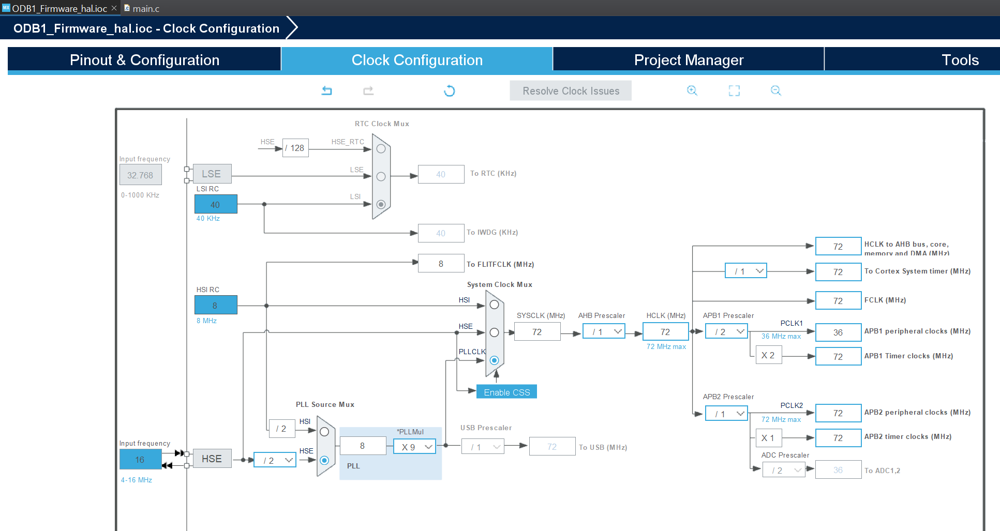
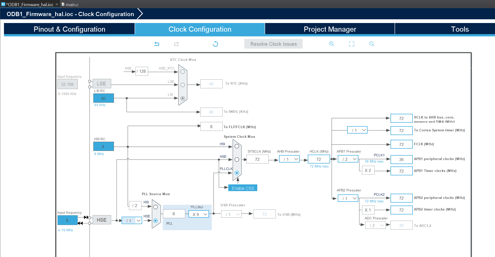

# ODB1 Firmware HAL


Repo qui contient le code HAL pour l'ordinateur de bord 1 (ODB1) du GAUL.

Le code officiel pour l'ODB1 se trouve sur le repo [GAULAvionique2023-2024/ODB1_Firmware](https://github.com/GAULAvionique2023-2024/ODB1_Firmware).

Différence entre les drivers HAL et LL (voir la [documentation ST UM1725](https://www.st.com/resource/en/user_manual/um1725-description-of-stm32f4-hal-and-lowlayer-drivers-stmicroelectronics.pdf)) :

- The HAL offers high-level and feature-oriented APIs with a high-portability level. These hide the MCU and peripheral complexity from the end-user.
- The LL offers low-level APIs at register level, with better optimization but less portability. These require deep knowledge of the MCU and peripheral specifications.

## Notes sur la documentation

Documenter le code pour qu'une personne qui récupère le projet sans moyen de communiquer avec l'auteur puisse comprendre facilement les différentes sections du projet.

Commenter pourquoi le code a été écrit d'une manière plutôt que de commenter ce que le code fait si c'est explicite.

Exemple de documentation en en-tête d'un driver :

```C
/*
 * BMP280.h
 *
 * BMP280 is a barometer used to get the altitude of the rocket.
 * Main functions are "BMP280_Init" to configure BMP280, and "BMP280_ReadAltitude"
 * to update values in a BMP280 structure.
 *
 *  Created on: May 18, 2024
 *      Author: gagnon
 *
 *  Edited on: Jul 4, 2024
 *      Autor: mathouqc
 *
 */
```

Exemple de documentation d'une fonction :

```C
/**
 * Read BMP280 register using GPIO and SPI2 HAL functions
 *
 * @param reg: u8bit register address to read.
 * @param RX_Buffer: u8bit array to store X bytes of data.
 * @param size: Number of bytes to read.
 *
 * @retval 0 OK
 * @retval -1 SPI ERROR
 */
int8_t BMP280_Read(uint8_t reg, uint8_t RX_Buffer[], uint8_t size) {
    // Enable SPI communication with BMP280 by setting BMP280's Chip Select (CS) pin to LOW.
    HAL_GPIO_WritePin(BMP_CS_GPIO_Port, BMP_CS_Pin, GPIO_PIN_RESET);

    // Transmit Control byte (Read mode + Register address)
    reg |= 0x80; // Read mode
    if (HAL_SPI_Transmit(BMP_hspi, &reg, 1, BMP280_SPI_TIMEOUT) != HAL_OK) {
    	return -1; // SPI ERROR
    }

    // Receive Data byte
    if (HAL_SPI_Receive(BMP_hspi, RX_Buffer, size, BMP280_SPI_TIMEOUT) != HAL_OK) {
    	return -1; // SPI ERROR
    }

    // Disable SPI communication with BMP280 by setting BMP280's Chip Select (CS) pin to HIGH.
    HAL_GPIO_WritePin(BMP_CS_GPIO_Port, BMP_CS_Pin, GPIO_PIN_SET);

    return 0; // OK
}
```

## Notes générales

Les fonctions retournent `0` si tout se passe bien, et `-1` s'il y a une erreur. Les fonctions peuvent aussi retourner d'autres valeurs négatives (`-2`, `-3`, ...) pour préciser le type d'erreur.

Écrire des tests ou des fonctions de debug dans un fichier séparé (par exemple `BMP280_tests.c` pour le driver `BMP280.c`) pour ne pas encombrer le fichier principal du driver et pour garder une trace des debug dans l'historique de commit du GitHub.

Faire des commits qui traitent un problème ou une fonctionnalité à la fois, et décrire les changements dans le message du commit.

## Driver disponible

- Altimètre BMP280

## TODO

- Driver pour le module GNSS L76-LM33
- Driver pour la carte SD
- Driver pour l'accéléromètre ICM20602
- Calculer la vitesse verticale avec le BMP280
- Pouvoir déterminer le moment de déploiment du parachute (voir documentation sur Teams dans `Fusée_Avionique/Design/ODB#1`)
- Mach Lock avec l'accéléromètre ou un timer (voir documentation sur Teams dans `Fusée_Avionique/Design/ODB#1`)
- Création de packets pour envoyer à la station au sol et pour enregistrer sur la carte SD

## Notes pour développement sur [Blue Pill](https://www.instructables.com/Setting-Up-Blue-Pill-Board-in-STM32CubeIDE/)

L'ODB1 a une horloge externe de 16 MHz, alors que le Blue Pill a une horloge externe de 8 MHz. Il faut donc modifier le fichier `ODB1_Firmware_hal.ioc` pour utiliser le code dans ce repo avec un board Blue Pill.

Dans `Clock Configuration`, mettre **8** au lieu de **16** dans `Input frequency` du `HSE`, puis changer le `/ 2` par `/ 1` :

_Clock Configuration pour l'ODB1 :_


_Clock Configuration pour Blue Pill :_


**Ne pas oublier de regénérer le code en sauvegardant le fichier ODB1_Firmware_hal.ioc**
